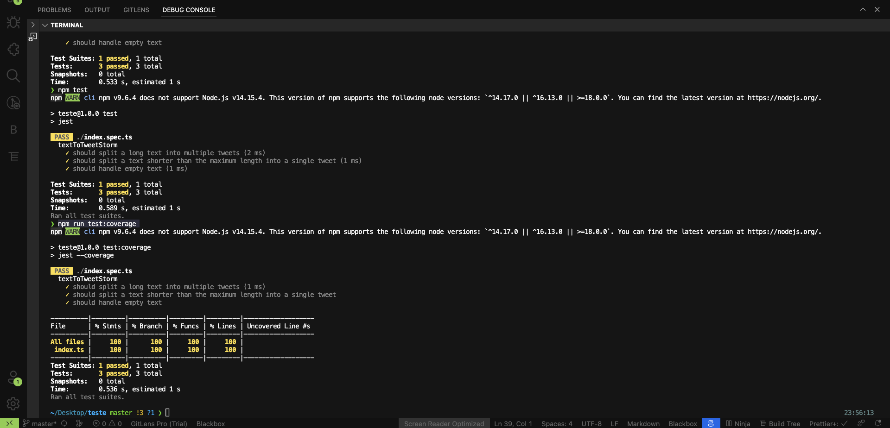
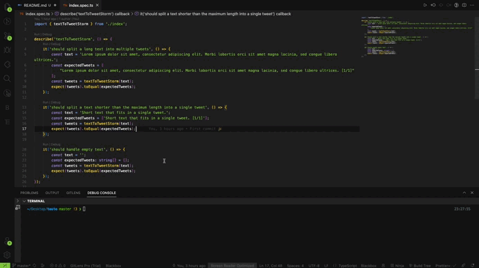

<h1 align="center">   </h1>

<h1 align="center"> Projeto Tweet Storm </h1>

## 👩🏽‍💻 Descrição

Projeto consiste criar uma função em TypeScript que transforma um texto em uma sequência de tweets (Tweet Storm) respeitando as limitações de tamanho do Twitter. A função quebra o texto em blocos menores de até 140 caracteres, incluindo a paginação. Cada tweet é numerado e possui a indicação da página atual e o total de páginas. O projeto também inclui testes automatizados para validar diferentes cenários.

## 📝 Requisitos

- O projeto é desenvolvido utilizando a linguagem TypeScript, o que permite uma maior segurança e facilidade na manipulação do código.

- A função implementada é capaz de dividir o texto em blocos menores, respeitando o limite de 140 caracteres estabelecido pelo Twitter. A quebra é feita levando em consideração a inclusão da paginação como parte do texto.

- Tratamento adequado para qualquer tamanho de texto: O projeto é capaz de lidar com textos de diferentes tamanhos, desde textos com apenas 1 caractere até textos com milhões de caracteres. A função de quebra é escalável e eficiente.

- Cada tweet gerado pelo projeto inclui a indicação da página atual e o total de páginas. Isso permite aos leitores entenderem em qual parte do texto estão e quantas páginas existem no total.

- Ao realizar a quebra do texto, o projeto garante que as palavras não sejam cortadas, mantendo a integridade do conteúdo. Isso evita quebras incompreensíveis e preserva a legibilidade.

- Testes automatizados em jest para validar o funcionamento correto do projeto. Isso proporciona maior confiabilidade e assegura que o código se comporte conforme o esperado em diferentes cenários.

## ⚒️ Tecnologias utilizadas

- [TypeScript](https://www.typescriptlang.org/)
- [Jest](https://jestjs.io/docs/getting-started)

## 🧪 Jest

O Jest é uma ferramenta essencial no desenvolvimento de software, pois permite a criação de testes automatizados robustos e confiáveis. Além disso, o Jest oferece suporte a cobertura de código, auxiliando na identificação de áreas não testadas e garantindo a qualidade do software. Sua simplicidade de uso e integração com outras ferramentas tornam o Jest uma escolha popular para a comunidade de desenvolvedores 

<h1 align="center">   </h1>

## 📽️ Demo: teste automatizado em jest

1. No terminal do editor de código utilizado, rodar o comando `npm test` para executar todos os testes automatizados definidos no projeto.
2. Depois, rodar o comando `npm run test:coverage` que fornece informações sobre a cobertura testes do código, ajudando a identificar áreas não testadas e melhorar a qualidade do código através de um relatório detalhado.

  

     
  

 

 Criado por
  <a href="https://github.com/Joseane-Guedes"> Joseane Guedes 💜 </a>

